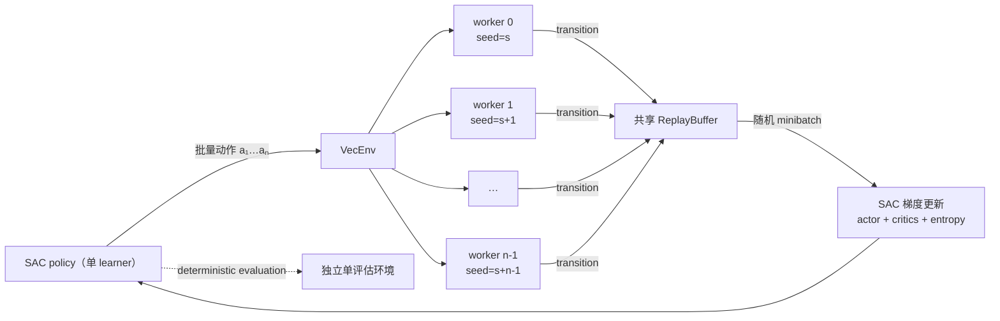

# SAC 并行环境采样技术说明

本文说明本仓库如何为 Stable-Baselines3（SB3）SAC 接入并行环境、各个计数参数的
精确定义，以及如何公平比较 `n_envs=1/2/4`。实现只并行环境采样；actor、critic、
target critic、replay buffer 和梯度更新仍由一个 SAC learner 管理，不是多 GPU 或
分布式 learner 训练。

对应实现：

- [`sac_experiments/lunarlander_common.py`](../sac_experiments/lunarlander_common.py)：
  构造 `DummyVecEnv` / `SubprocVecEnv`。
- [`sac_experiments/training.py`](../sac_experiments/training.py)：训练、评估、callback
  频率换算和 summary。
- [`sac_experiments/config.py`](../sac_experiments/config.py)：`n_envs` 及整除约束。
- [`configs/parallel_baseline.yaml`](../configs/parallel_baseline.yaml)：正式四环境基线。
- [`configs/parallel_smoke.yaml`](../configs/parallel_smoke.yaml)：双环境短流程检查。

## 1. 执行结构



当 `n_envs=1` 时，训练环境使用 `DummyVecEnv`，使单环境和多环境走同一套 SB3
`VecEnv` 接口。当 `n_envs>1` 时，每个 LunarLander 环境由 `SubprocVecEnv` 放入独立
子进程。主进程批量计算动作，子进程并发执行 `env.step()`，结果汇总后一次写入 replay
buffer。

评估环境始终是独立的单环境，不向 replay buffer 写数据，也不与训练 worker 共享 episode
状态。SB3 会把它包装成 `DummyVecEnv`，因此并行训练时可能看到训练环境
`SubprocVecEnv` 与评估环境 `DummyVecEnv` 类型不同的 warning。只要 observation/action
space 和 wrapper 一致，这个提示不影响评估正确性。

## 2. transition、VecEnv step 与总步数

定义：

- $n$：`environment.n_envs`；
- $f$：`sac.train_freq`，当前配置使用 step 单位；
- $g$：`sac.gradient_steps`；
- $T$：`training.timesteps`，表示所有 worker 合计的 transition 数。

一次 `VecEnv.step()` 同时从 $n$ 个环境各收集一条 transition，因此：

$$
\Delta T_{\mathrm{vec\ step}} = n.
$$

SB3 每完成一次 `VecEnv.step()`，其 `num_timesteps` 增加 $n$，而不是增加 1。一次完整
rollout/train cycle 在当前 step-based `train_freq` 下收集：

$$
N_{\mathrm{collect}} = n f
$$

条 transition，然后执行 $g$ 次 minibatch 梯度更新。

本仓库要求 `training.timesteps` 能被 `n_envs` 整除。正式配置使用 $f=1$，因此可以精确
停在目标 transition 数。如果未来设置 $f>1$，为了避免最后一个 rollout block 越过目标，
还应让 $T$ 能被 $nf$ 整除。

## 3. 为什么四环境使用四次梯度更新

比较单环境与并行环境时，不能只改 `n_envs` 而保持 `gradient_steps=1`。每个 cycle 的
梯度更新/transition 比例为：

$$
\rho_{\mathrm{update}}
= \frac{g}{nf}.
$$

当前两个正式基线的比例是：

| 配置 | $n$ | $f$ | $g$ | $\rho_{\mathrm{update}}$ |
|---|---:|---:|---:|---:|
| 单环境 `baseline.yaml` | 1 | 1 | 1 | 1 |
| 四环境 `parallel_baseline.yaml` | 4 | 1 | 4 | 1 |

如果四环境仍设置 $g=1$，则 $\rho_{\mathrm{update}}=1/4$。这可能提高 wall-clock
吞吐率，却同时减少每条数据获得的优化计算量，导致算法条件不再等价。设置 $g=4$ 的目的
不是保证学习曲线完全相同，而是先控制最直接的 update-to-data ratio。

SB3 还支持 `gradient_steps=-1`，表示按本轮收集的 transition 数决定更新次数。本仓库当前
YAML 校验只接受正整数，所以正式实验显式写出 `gradient_steps: 4`，让 summary 和配置保持
自描述。

## 4. replay buffer 的实际布局

所有 worker 使用同一个 SB3 replay buffer，不存在独立的 worker buffer。SB3 2.7.0 将
配置容量 $B$ 转换为时间轴长度：

$$
B_{\mathrm{time}} = \max\left(\left\lfloor\frac{B}{n}\right\rfloor, 1\right).
$$

主要数组的逻辑形状为：

$$
\texttt{observations.shape}
= (B_{\mathrm{time}}, n, \ldots).
$$

所以实际 transition 容量约为：

$$
B_{\mathrm{effective}} = nB_{\mathrm{time}} \le B.
$$

当 $B$ 能被 $n$ 整除时容量恰好等于配置值。采样 minibatch 时，SB3 同时随机选择时间
索引和环境索引，来自不同 worker 的 transition 会混合进入同一次 actor/critic 更新。
并行环境的主要统计作用是提高同一时间段内的数据多样性，并降低完全由单条轨迹造成的短程
相关性；它不会把 SAC 改成 on-policy 算法。

`learning_starts` 同样按总 transition 数判断。四环境下经过
$10000/4=2500$ 次 VecEnv step 会到达阈值；SB3 使用严格的 `num_timesteps >
learning_starts` 条件，所以第一批梯度更新在下一次 VecEnv step 后、即 10004 个总
transition 时发生。单环境基线也遵循相同的“超过阈值”语义。

## 5. callback 与 checkpoint 频率

SB3 callback 每次 `VecEnv.step()` 调用一次。用户在 YAML 中填写的
`evaluation.frequency` 定义为总 transition 间隔 $F$，训练器换算为：

$$
F_{\mathrm{callback}} = \frac{F}{n}.
$$

配置校验要求 $F$ 能被 $n$ 整除。四环境正式配置中：

$$
F=10000,\qquad n=4,\qquad F_{\mathrm{callback}}=2500.
$$

因此评估和 checkpoint 仍在 10k、20k、30k 等总 transition 位置触发，而不是被推迟到
40k。summary 同时记录 `eval_freq` 和 `callback_freq_vec_steps`，便于检查外部语义和
SB3 内部调用频率。

## 6. 随机种子和训练/评估隔离

基准 seed 为 $s$ 时，第 $i$ 个训练 worker 使用：

$$
s_i = s + i,\qquad i\in\{0,1,\ldots,n-1\}.
$$

当前评估环境使用：

$$
s_{\mathrm{eval}} = s+n,
$$

从而不与同一次训练中的 worker seed 重合。每个 worker 还分别 seed 环境、action space 和
observation space；每个 worker 的 `Monitor` 数据写入独立目录，避免并发写同一个 CSV。

需要注意：$s_{\mathrm{eval}}=s+n$ 会使不同 `n_envs` 实验使用不同评估 seed。因此当前实现
适合通过多 base-seed 的均值/标准差做总体比较，但还不是严格的 paired evaluation。若要做
逐 seed 配对检验，后续应把 eval seed 或固定 episode seed 列表做成与 $n$ 无关的显式配置。

## 7. summary 中的效率指标

每个 variant 的 JSON summary 新增：

- `n_envs`、`vec_env`；
- `worker_seeds`、`eval_seed`；
- `callback_freq_vec_steps`；
- `training_wall_time_seconds`；
- `sampled_transitions`；
- `sample_throughput_transitions_per_second`；
- `gradient_updates_per_transition`。

吞吐率定义为：

$$
q_{\mathrm{sample}}
= \frac{T_{\mathrm{sampled}}}{t_{\mathrm{learn}}}.
$$

这里的 $t_{\mathrm{learn}}$ 是整个 `model.learn()` 的 wall-clock，包含训练期间的评估和
checkpoint 时间。因此它反映端到端实验吞吐率，而不是剔除 callback 开销后的纯环境 FPS。

## 8. SAC 是否适合这种并行方式

SAC 是 off-policy 算法，采样数据进入 replay buffer 后可以被重复使用，因此能够接受多个
并行环境生成的数据。并行采样通常有三种潜在收益：

1. 隐藏昂贵环境的单步计算等待；
2. 在相同 wall-clock 内收集更多样的状态和动作；
3. 提高 learner 的数据供应速度，减少 GPU 等待环境的时间。

但 `LunarLanderContinuous-v3` 本身较轻，子进程调度、序列化和 IPC 可能比物理仿真更贵。
用一个简化的 cycle 模型表示：

$$
t_{\mathrm{cycle}}
\approx f\left(\max_i t_{\mathrm{env},i}+t_{\mathrm{IPC}}\right)
+g\,t_{\mathrm{grad}},
$$

$$
q_{\mathrm{cycle}}
\approx \frac{nf}{t_{\mathrm{cycle}}}.
$$

增加 $n$ 只会缩短或隐藏环境部分，不能并行当前单 learner 的 $g$ 次梯度更新。若
$t_{\mathrm{grad}}$ 已占主要时间，或 $t_{\mathrm{IPC}}$ 大于节省的环境时间，增加 worker
不会提升端到端速度，甚至会更慢。因此结论必须来自实测，而不能由“进程更多”直接推出。

## 9. 公平实验协议

建议至少比较 $n\in\{1,2,4\}$，并保持以下条件：

| 控制项 | 要求 |
|---|---|
| 总 transition | 每组均为 500k |
| 更新比例 | 保持 $g/(nf)=1$，即 $g=n$、$f=1$ |
| 网络和 SAC 参数 | 除 `gradient_steps` 外保持一致 |
| 评估间隔 | 均按总 transition 每 10k 评估 |
| 评估 episode 数 | 每次 10 episodes |
| base seeds | 推荐 0、1、2、3、4 |
| 输出 | 每次使用不同 `output.run_tag` |

每组至少报告：

- 端到端 wall-clock 和 transition/s；
- GPU 利用率、显存、CPU 利用率；
- best/final deterministic eval；
- last-$N$ eval 的 mean/std；
- 多 seed 均值、标准差和失败次数。

不能只根据 smoke reward、SB3 `time/fps` 或单 seed best reward 判断并行方案优劣。

## 10. 运行与验证

四环境正式基线：

```bash
conda run -n sac_sb3_demo python main.py \
  --config configs/parallel_baseline.yaml
```

双环境流程检查：

```bash
conda run -n sac_sb3_demo python main.py \
  --config configs/parallel_smoke.yaml
```

smoke 只验证子进程创建、数据收集、梯度更新、评估、checkpoint 和 summary 是否贯通，
其 reward 不能作为研究结果。

## 11. 参考

- [SB3：Multiprocessing with off-policy algorithms](https://stable-baselines3.readthedocs.io/en/v2.4.1/guide/examples.html#multiprocessing-with-off-policy-algorithms)
- [SB3：Vectorized Environments](https://stable-baselines3.readthedocs.io/en/v2.7.0/guide/vec_envs.html)
- [SB3：Callbacks](https://stable-baselines3.readthedocs.io/en/v2.7.0/guide/callbacks.html)
- [SB3：SAC](https://stable-baselines3.readthedocs.io/en/v2.7.0/modules/sac.html)
- [SB3 2.7.0 source：ReplayBuffer](https://github.com/DLR-RM/stable-baselines3/blob/v2.7.0/stable_baselines3/common/buffers.py)
- [SB3 2.7.0 source：OffPolicyAlgorithm](https://github.com/DLR-RM/stable-baselines3/blob/v2.7.0/stable_baselines3/common/off_policy_algorithm.py)
